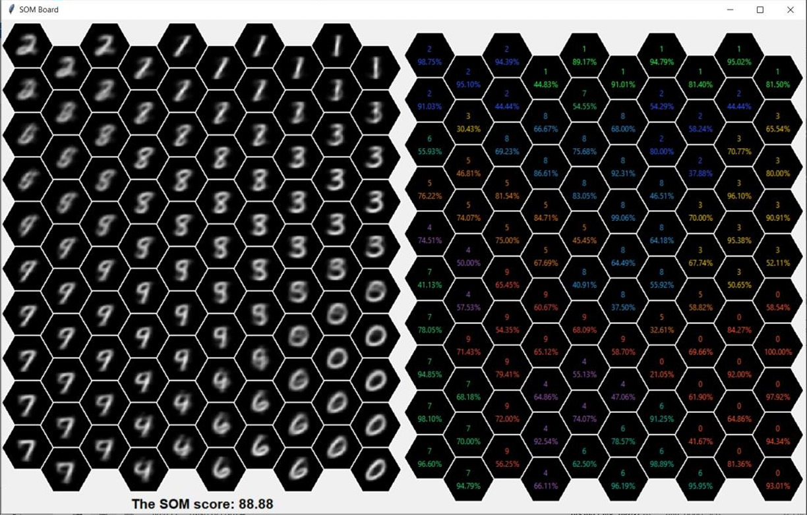

# Computational Biology - Self-Organizing Map (SOM)

## Overview
This report details the implementation and application of the Self-Organizing Map (SOM) algorithm to classify groups of data (number vectors) into representative neurons. The SOM algorithm consists of several simple steps:
1. Create and initialize a group of neurons.
2. Iterate over the data to find the Best Matching Unit (BMU) for each vector.
3. Approximate each BMU vector to its corresponding data vector and its neighbors.
4. Repeat steps 2-3 until the stopping condition is met.

This report is divided into seven parts:
1. The Neural Network
2. The BMU Vector
3. Neighbors Update
4. Learning Rate
5. The Nature of the Solution
6. Running the Model
7. Running Instructions

## The Neural Network

### Representation of the Neurons
When implementing a SOM network, the neurons must be kept in a data structure, which is updated during the running of the algorithm. The data structure we chose is a grid made of hexagons, where each member of the grid is a vector of size 784, as the size of a 28x28 image, and within each cell of the neuron vector there is a value between 0-255 representing a black-and-white color. To simplify the use of hexagons, we created a class called `HexBoard`, in which all the handling of the data structure manag...

### Initializing the Neurons
We chose to initialize each neuron by iterating over the data, taking a sample for each neuron, summing them up element-wise, and calculating an average. We created 100 average vectors, defined as the neurons of the network. For \(N_i\) the \(i\)-th neuron and \(u_j\) the \(j\)-th vector in the data set:

$$orall 1 \leq i \leq 100, orall 1 \leq j \leq 10000, j \% 100 = i: N_i = rac{\sum_j u_j}{100}$$

The reason for this initialization is to capture common characteristics in the data, such as a black frame present in all images.

### Number of Neurons in the Network
The number of neurons in the network is 100, which is logical given there are 10 possible values. This setup allows about ten neurons for each digit, accommodating different elements in each digit and better separating different variants.

## The BMU Vector
In each iteration of the algorithm, we go through all data members, find a BMU for each member, and approximate the BMU to that member. The BMU (Best Matching Unit) is the neuron vector from the network that is "closest" to the data vector sampled each time. Proximity is defined using Euclidean distance:

$$ext{BMU} = rg\min_i \left\{ \sqrt{\sum_{j=0}^{10000} (N_i - u_j)^2} ight\}$$

The update process involves looping over all vectors in the data set, extracting the BMU indices, updating the neuron value (BMU) in the network, and updating the neighbors of the BMU.

```python
def update():
    global NEURONS_MATRIX

    for vector in DS:
        idx = extract_bmu_idx(vector)
        i, j = idx
        NEURONS_MATRIX[i][j] = calc_update(vector, NEURONS_MATRIX[i][j], LEARNING_RATE)
        neighbors_update(vector, idx)
```

## Neighbors Update
The neuron network in the SOM model considers the location of neurons, aiming for similar neurons to be close. When updating a neuron, its neighbors are also updated with decreasing intensity to avoid disrupting the network. The update process is as follows:

```python
def neighbors_update(vector, idx):
    global NEURONS_MATRIX

    first_learning_rate = LEARNING_RATE / (ITERATIONS + 1)
    second_learning_rate = first_learning_rate / (ITERATIONS + 1)
    i, j = idx

    first_layer = []
    second_layer = []
    first_layer_directions = []
    second_layer_directions = []

    if j % 2 == 1:
        first_layer_directions = [(0, -1), (0, 1), (1, -1), (1, 0), (1, 1), (-1, 0)]
        second_layer_directions = [(-2, 0),(-1, 1), (-1, 2), (0, 2), (1, 2), (2, 1), (2, 0), (-1, -1), (-1, -2), (0, -2), (1, -2), (2, -1)]

    if j % 2 == 0:
        first_layer_directions = [(-1, -1), (-1, 0), (-1, 1), (0, 1), (0, -1), (1, 0)]
        second_layer_directions = [(-2, -1), (-2, 0), (-2, 1), (-1, 2), (0, 2), (1, 2), (-1, -2 ), (0, -2), (1, -2), (1, -1), (1, 1), (2, 0)]

    for di, dj in first_layer_directions:
        ni, nj = i + di, j + dj
        if 0 <= ni < 10 and 0 <= nj < 10:
            first_layer.append((ni, nj))

    for di, dj in second_layer_directions:
        ni, nj = i + di, j + dj
        if 0 <= ni < 10 and 0 <= nj < 10:
            second_layer.append((ni, nj))

    for ni, nj in first_layer:
        NEURONS_MATRIX[ni][nj] = calc_update(vector, NEURONS_MATRIX[ni][nj], first_learning_rate)

    for ni, nj in second_layer:
        NEURONS_MATRIX[ni][nj] = calc_update(vector, NEURONS_MATRIX[ni][nj], second_learning_rate)
```

## Learning Rate
The learning rate affects the level of learning at each stage of building the network. It is updated during the run from iteration to iteration and varies between the BMU and its neighbors. The initial learning rate is set to 0.3, and it decreases over time. The update process is given by:

\[ N_i^{(t+1)} = N_i^t + \lambda (u_j - N_i^t) \]

Where \(\lambda\) is the learning rate. The learning rate for neighbors is adjusted by dividing by the number of iterations plus one for the first layer and by the number of iterations plus one squared for the second layer.

```python
def calc_update(vector, neurons, learning_rate):
    return neurons + learning_rate * (vector - neurons)
```

## The Nature of the Solution
The solution is evaluated based on topological proximity in the network and error distance. The score calculation is as follows:

```python
def calc_score(board):
    total_score = 0
    num_sample = 0
    max_euclidean_distance_value = np.sqrt(VECTOR_LENGTH * (255 ** 2))
    max_topological_distance_value = 13

    for vector in DS:
        num_sample = num_sample + 1
        i, j = extract_bmu_idx(vector)
        error_euclidean_distance = 100 * (euclidean_distance(vector, NEURONS_MATRIX[i][j]) / max_euclidean_distance_value)

        first_closest_neuron_idx, second_closest_neuron_idx = find_two_best_neurons(vector)
        topological_distance = board.topological_distance(first_closest_neuron_idx, second_closest_neuron_idx) - 1
        error_topological_distance = 100 * (topological_distance / max_topological_distance_value)

        total_score = total_score + (100 - (0.5 * error_euclidean_distance + 0.5 * error_topological_distance))

    return total_score / num_sample
```

The score formula is given by:

$$\text{SCORE} = \frac{\sum_{j=1}^{10000} \left[ 100 - \left( \frac{100 \cdot TD(N_1^j, N_2^j)}{\max_{k,l} {TD(N_k, N_l)}} \cdot 0.5 + \frac{100 \cdot ED(N_1^j, u_j)}{\sqrt{784*255^2}} \cdot 0.5 \right) \right]}{10000}$$


## Running the Model
The algorithm was run for 10,000 iterations, and the change in the learning rate over time was tracked.



## Running Instructions
To run the model, follow these steps:
1. Clone the repository: [https://github.com/YuvalDahari/SOM-Algorithm](https://github.com/YuvalDahari/SOM-Algorithm)
2. Navigate to the project directory.
3. Ensure all dependencies are installed.
4. Run the main script to start the SOM algorithm.
